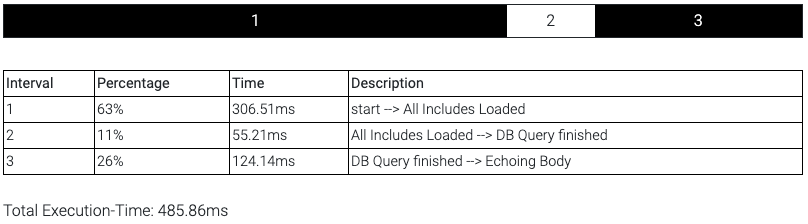
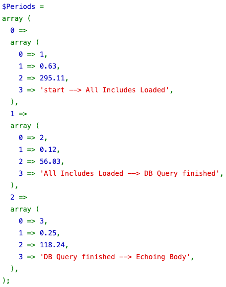
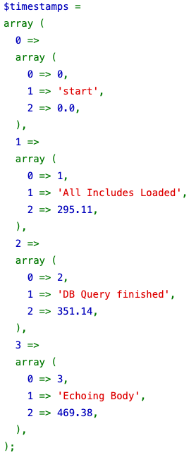

# ⏱ Measure PHP ExecutionTime
Simple tool for measuring PHP execution time.

## Features
- Super easy to use
- HTML visualisation
- No Dependencies

## Documentation
### Instantiate an object

```php
require("timetracker.php");

$timer = new timetracker("start"); // Example Description
```

### Add more timepoints if necessary

```php
// Some Code
$timer->add("All Includes Loaded");

// Some Code
$timer->add("DB Query finished");

// Some Code
$timer->add("Echoing Body");
```

### Show the Results
The HTML Output:

> ```php
> $timer->htmlOut();
> ```
> 


The Text Output:

> ```php
> $timer->logPeriods();
> ```
> 


The Text Output of raw Timestamps:

> ```php
> $timer->logTimestamps();
> ```
> 
